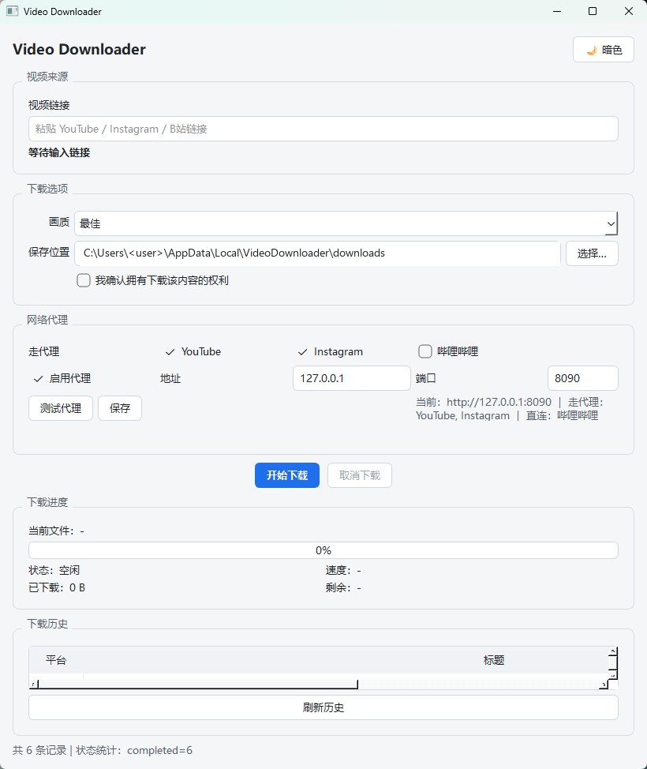
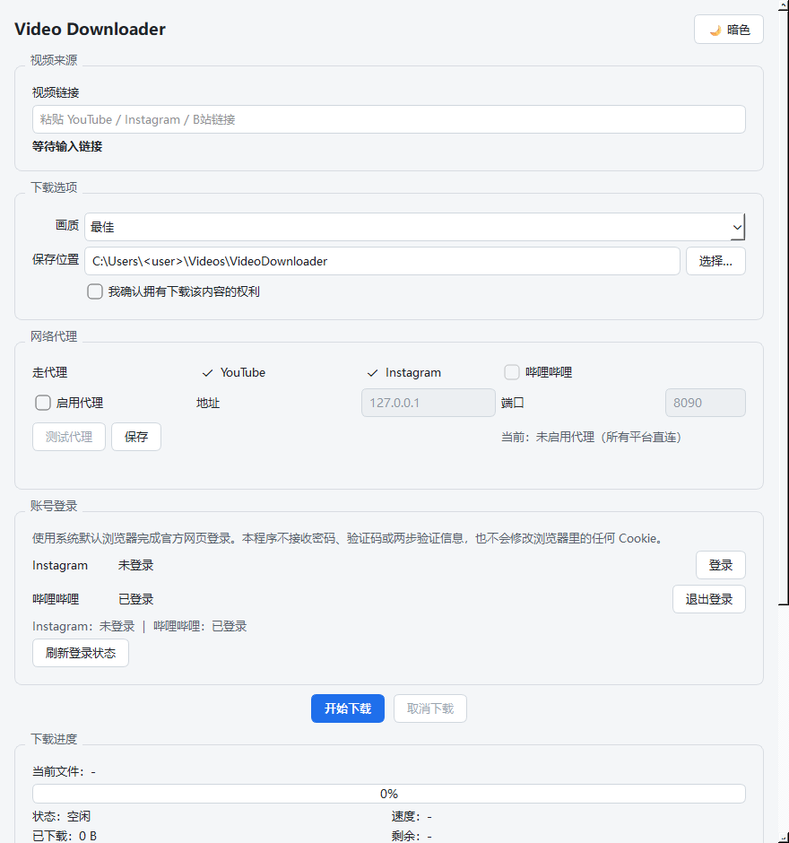

# Video Downloader

> 多平台公开视频下载器 —— 输入公开视频链接，获取信息、下载、保存到本地。
> 支持 **YouTube / Instagram / 哔哩哔哩**，提供 **桌面 GUI** 与 **命令行 CLI** 两种入口。




<sub>暗色主题见 [`docs/gui-dark.png`](docs/gui-dark.png)。</sub>

---

## 目录

- [合规声明（请先阅读）](#合规声明请先阅读)
- [功能特性](#功能特性)
- [技术栈](#技术栈)
- [各平台的实际能力](#各平台的实际能力)
- [系统依赖](#系统依赖)
- [本地运行](#本地运行)
- [账号登录](#账号登录)
- [Docker 部署](#docker-部署)
- [一键部署](#一键部署)
- [启动 / 停止 / 更新脚本](#启动--停止--更新脚本)
- [环境变量说明](#环境变量说明)
- [关于端口](#关于端口)
- [输出布局](#输出布局)
- [数据库](#数据库)
- [项目目录结构](#项目目录结构)
- [测试与质量](#测试与质量)
- [Windows EXE 打包](#windows-exe-打包)
- [自动发布](#自动发布)
- [常见问题](#常见问题)
- [License](#license)

---

## 合规声明（请先阅读）

本工具只处理**你自己拥有、已获授权，或平台明确允许下载**的公开内容。

- 三个平台的服务条款均不鼓励未授权下载；YouTube ToS 明确禁止，德国法院 2024 年已就同类工具作出对 YouTube 有利的判决。
- 本项目**不绕过** CAPTCHA、登录限制、DRM、付费墙、私人账号权限或任何访问控制。
- 无法公开访问的内容（私密、仅粉丝可见、付费、地区限制、会员专享）不会下载，会直接报错退出。
- 对未使用官方 API 的平台，CLI 要求显式传入 `--confirm-rights`，并在下载日志中记录该声明。
- 请自行承担使用风险，遵守当地法律与平台条款。

> 抖音**已明确不在支持范围内**。其 `aweme/v1/web/aweme/detail` 接口由 ArgusSecurityPlugin 保护，要求浏览器端生成的请求签名（`a_bogus`），携带完整登录 Cookie 也一律返回 `HTTP 403`。实现该签名属于绕过平台反爬安全机制，本项目不做。

---

## 功能特性

- **多平台**：YouTube / Instagram / 哔哩哔哩，统一接口 + 平台 Adapter 架构，上层代码不认识任何具体平台。
- **双入口**：PySide6 桌面 GUI 与 Typer 命令行 CLI，共用同一套下载核心、同一份 `.env`、同一个数据库。
- **画质选择**：`best` / `2160p` / `1440p` / `1080p` / `720p` / `480p` / `360p` / `audio`（仅音频 m4a）。
- **高清优先**：DASH 音视频分离时自动分别下载，再用 ffmpeg `-c copy` 无损合并（不重编码）。
- **实时进度**：视频 / 音频双进度条、速度、已下载大小、剩余时间；GUI 后台线程下载，窗口不卡。
- **断点续传**：`.part` 文件 + `Range` 请求；服务器不支持 Range 时自动重新下载。
- **失败重试**：指数退避，默认 3 次；网络超时与连接超时独立控制。
- **完整性检查**：Content-Length 比对 + 媒体头嗅探 + ffprobe 时长偏差告警（> 5%）。
- **避免重复**：SQLite 记录命中且文件仍存在时直接跳过（`--force` 可强制重下）。
- **下载历史**：GUI 表格展示，CLI 用 `--history` 查看。
- **文件名清洗**：非法字符、Windows 保留名、结尾空格与点自动处理。
- **网络代理**：支持 HTTP 代理，并可按平台绕过（B 站走直连以避开风控 412）。
- **账号登录**：哔哩哔哩与 Instagram 可用**系统默认浏览器**完成官方网页登录，会话按平台隔离保存；不接收密码、验证码，不用内嵌 WebView，不装浏览器扩展。
- **主题**：明亮 / 暗色。

---

## 技术栈

| 层次 | 选型 |
| --- | --- |
| 语言 | Python **3.12+** |
| 桌面 GUI | PySide6（Qt for Python） |
| 命令行 | Typer + Rich |
| HTTP | httpx（HTTP/2） |
| 视频抽取 | yt-dlp |
| 配置 | pydantic + pydantic-settings（`.env`） |
| 重试 | tenacity |
| HTML 解析 | selectolax |
| 异步文件 IO | aiofiles |
| 存储 | SQLite（WAL 模式） |
| 依赖管理 | [uv](https://docs.astral.sh/uv/)（`pyproject.toml` + `uv.lock`） |
| 打包 | PyInstaller（Windows onedir） |
| 代码质量 | pytest / respx / mypy / ruff / pytest-qt |
| 音视频合并 | ffmpeg（外部依赖） |

---

## 各平台的实际能力

| 平台 | 元数据来源 | 媒体文件来源 | 需要 `--confirm-rights` |
| --- | --- | --- | --- |
| 哔哩哔哩 | 官方 web 接口 `x/web-interface/view`（播放器自己用的公开接口） | `x/player/wbi/playurl`（WBI 签名，DASH） | 否 |
| YouTube | 官方 Data API v3（需 `YOUTUBE_API_KEY`） | yt-dlp 抽取引擎（官方无下载 API） | 是 |
| Instagram | Graph API（自有账号）/ yt-dlp | Graph API `media_url`（自有账号直链 mp4）；公开帖子走 yt-dlp + 浏览器登录态 | 是（配置 Graph 凭据后自动免除） |

关键事实：

- YouTube Data API **没有下载端点**，`fileDetails`、`captions.download` 只对你自己拥有版权的视频开放。
- Instagram Graph API 是唯一能官方直接拿到视频文件的接口，VIDEO 类型的 `media_url` 就是 mp4 直链；但它只覆盖已授权账号自己的作品，且链接会过期，因此从不写入数据库。
- 哔哩哔哩匿名会话最高 480P；配置 `BILIBILI_SESSDATA` 后可达该账号权限内的画质（普通账号 1080P，大会员更高）。
- Instagram 的公开帖子只对已登录会话返回数据，因此需要 `YTDLP_COOKIEFILE` 提供浏览器导出的登录态。

---

## 系统依赖

| 依赖 | 必需性 | 说明 |
| --- | --- | --- |
| **Python 3.12+** | 必需 | 运行环境 |
| **ffmpeg / ffprobe** | 必需（下载高清时） | DASH 音视频合并；缺失时无法合并分离流 |
| uv | 推荐 | 依赖管理与环境准备（也可用 pip + venv） |

**ffmpeg 的查找顺序**（`core/merger.py`）：

1. `.env` 中的 `FFMPEG_PATH`（可指向可执行文件或其所在目录）
2. 项目内 `tools/ffmpeg/bin/ffmpeg.exe`（Windows）或 `tools/ffmpeg/bin/ffmpeg`（类 Unix）
3. 系统 `PATH`

> Docker 镜像会在构建时通过 `apt-get install ffmpeg` 自动安装 ffmpeg，**无需手工处理**。

Windows 本地安装 ffmpeg 的方式（任选其一）：

```powershell
# 方式 A：放到项目内（推荐，随项目自包含）
#   解压静态构建，使 tools\ffmpeg\bin\ffmpeg.exe 与 ffprobe.exe 存在

# 方式 B：交给包管理器
winget install Gyan.FFmpeg
# 或
scoop install ffmpeg
```

---

## 本地运行

### 1. 准备 Python 环境

推荐使用 [uv](https://docs.astral.sh/uv/)（会自动下载并管理 Python 3.12）：

```bash
# Linux / macOS
curl -LsSf https://astral.sh/uv/install.sh | sh

# Windows PowerShell
irm https://astral.sh/uv/install.ps1 | iex
```

```bash
# 安装依赖（含开发依赖）
uv sync --dev
```

> 不使用 uv 时：`python -m venv .venv`，激活后 `pip install -e .`（或按 `pyproject.toml` 手动安装依赖）。

### 2. 配置

```bash
cp .env.example .env        # Linux / macOS / Git Bash
```

```powershell
Copy-Item .env.example .env  # Windows PowerShell
```

所有凭据都是**可选**的；不配置时自动降级到公开 web 路径。详见[环境变量说明](#环境变量说明)。

### 3. 启动 CLI

```bash
uv run python main.py "https://www.bilibili.com/video/BV1GJ411x7h7"
uv run python main.py "URL" --output ./downloads
uv run python main.py "URL" --quality 1080p
uv run python main.py "URL" --quality audio          # 只保留音频（m4a）
uv run python main.py "URL" --force                  # 忽略数据库记录，重新下载
uv run python main.py "URL" --confirm-rights         # 确认有权下载（非官方通道必需）
uv run python main.py --list-platforms               # 查看已注册平台
uv run python main.py --history                      # 查看下载记录
uv run python main.py --help                         # 全部参数
```

若目标画质不可用，会自动回退到最接近的更低画质；若全部高于目标，则取可用的最低画质。

### 4. 启动桌面 GUI

```bash
uv run python gui.py
```

Windows 上也可直接使用便捷脚本：

```powershell
.\scripts\run-gui.ps1
```

GUI 只是现有下载核心的界面层，**不复制任何下载逻辑**：它调用同一个 `DownloadService`、同一份 `.env`（代理、`secrets/cookies.txt`）、同一个 SQLite 数据库和同一套日志。

功能：粘贴链接自动识别平台、画质选择、保存目录选择、后台下载（窗口不卡）、真实进度 / 速度 / 已下载大小 / 剩余时间、取消下载、下载历史、明亮与暗色主题。

- 未支持的平台（例如抖音）显示「暂不支持该平台」。
- YouTube / Instagram 需要勾选「我确认拥有下载内容的权利」，等同 CLI 的 `--confirm-rights`。
- 代理与 Cookie 完全沿用 `.env`。
- 取消下载会保留已下载的分片，下次可断点续传。

---

## 账号登录

GUI 的「账号登录」分组可以为 **哔哩哔哩** 与 **Instagram** 分别保存登录状态，两个平台的会话完全隔离。



点击「登录」之后：

1. 用 **Windows 默认浏览器**打开该平台的**官方登录页面**；
2. 你在浏览器里自行完成登录（包括两步验证）；
3. 回到软件点击「我已登录，检测会话」，程序读取该会话并向平台官方接口确认登录状态；
4. 确认有效后，才把该平台的 Cookie 写入 `secrets/<平台>_cookies.txt`。

设置界面会显示 `未登录 [登录]`、`已登录 [退出登录]`、`登录已过期 [重新登录]`；下载时自动使用对应平台的会话，需要登录却没有会话时会提示你去登录。

### 安全边界

本功能**不做**以下任何一件事：

- 不使用内嵌 WebView，不要求特定浏览器，不安装浏览器扩展；
- 不接收、不保存你的密码、验证码或两步验证信息；
- 不修改、不删除、也不导出浏览器里的其他 Cookie；
- 不绕过平台登录验证或任何安全机制。

读取浏览器会话走的是 yt-dlp 官方支持的 `--cookies-from-browser` 机制，且只保留属于该平台的 Cookie。「退出登录」只删除本程序保存的 `secrets/<平台>_cookies.txt`，浏览器完全不受影响。

### 已知限制：Chromium 的 App-Bound Encryption

**Chrome / Edge 127 及以上**用 App-Bound Encryption（v20）加密 Cookie，密钥由浏览器自身保护，**yt-dlp 无法解密**。因此在默认浏览器是 Chrome 或 Edge 的机器上，第 3 步的自动读取会失败。

程序会**在你点登录之前**就检测到这一点（只读浏览器的 `Local State` 标记，不接触 Cookie 数据库），并在登录窗口顶部直接说明；万一仍然尝试失败，也不会静默失败——它会明确告诉你原因（加密 / 浏览器占用 / 未安装）、列出尝试过的每个浏览器及各自结果，并引导你使用**「手动填写会话」**：

> 在已登录的浏览器中按 `F12` → `Application`（应用）→ `Cookies` → 该平台域名 → 复制 `SESSDATA`（B 站）或 `sessionid`（Instagram）粘贴进来。程序会**先向平台校验**，通过后才写入 `secrets/`。

希望全自动的话，把登录用的浏览器换成 **Firefox** 即可（Firefox 的 Cookie 不加密，yt-dlp 可以直接读取）。

> `.env` 中已有的 `BILIBILI_COOKIEFILE` / `YTDLP_COOKIEFILE` / `YTDLP_COOKIES_FROM_BROWSER` 配置**仍然有效**；优先级为 `BILIBILI_COOKIE` / `BILIBILI_SESSDATA` > 本窗口保存的会话 > 上述 `.env` 文件路径。

---

## Docker 部署

本项目的容器镜像面向 **无界面 CLI**。桌面 GUI 需要显示设备，无法在无显示的容器中运行，因此镜像只打包 CLI（`main.py`），并自动安装 ffmpeg。

### 构建镜像

```bash
docker build -t video-downloader:latest .
```

### 运行

```bash
# Linux / macOS
docker run --rm \
  -v "$PWD/downloads:/app/downloads" \
  -v "$PWD/logs:/app/logs" \
  video-downloader:latest \
  "https://www.bilibili.com/video/BV1GJ411x7h7"

# Windows PowerShell
docker run --rm `
  -v "${PWD}\downloads:/app/downloads" `
  -v "${PWD}\logs:/app/logs" `
  video-downloader:latest `
  "https://www.bilibili.com/video/BV1GJ411x7h7"
```

带配置与凭据运行（可选）：

```bash
docker run --rm \
  -v "$PWD/.env:/app/.env:ro" \
  -v "$PWD/secrets:/app/secrets:ro" \
  -v "$PWD/downloads:/app/downloads" \
  -v "$PWD/logs:/app/logs" \
  video-downloader:latest "URL" --quality 1080p --confirm-rights
```

### 使用 Docker Compose

```bash
cp .env.example .env            # 可选，所有值均有默认
docker compose build
docker compose run --rm video-downloader "https://www.bilibili.com/video/BV1GJ411x7h7"
```

`docker-compose.yml` 只定义**单个服务**：本项目没有数据库服务器（历史是本地 SQLite 文件）、没有缓存、没有 Web 前端，单服务即正确拓扑。

> 容器**不监听任何端口**，因此 compose 中刻意没有 `ports:`。

---

## 一键部署

提供跨平台一键脚本，自动完成：检查 Docker → 准备 `.env` → 构建镜像 → 冒烟测试。

```bash
./scripts/deploy.sh              # Linux / macOS / Git Bash
```

```powershell
.\scripts\deploy.ps1             # Windows PowerShell
```

脚本执行成功后会打印后续可用的运行 / 停止 / 更新命令。

---

## 启动 / 停止 / 更新脚本

`scripts/` 目录同时提供 Shell 与 PowerShell 两套脚本：

| 脚本 | 作用 |
| --- | --- |
| `deploy.sh` / `deploy.ps1` | 一键部署：构建镜像 + 冒烟测试 |
| `start.sh` / `start.ps1` | 在容器中运行一次下载（无参数时进入交互式 shell） |
| `stop.sh` / `stop.ps1` | 停止并移除容器 |
| `update.sh` / `update.ps1` | 拉取最新基础镜像、重建镜像并验证 |
| `run-gui.sh` / `run-gui.ps1` | 本地启动桌面 GUI（非 Docker） |

示例：

```bash
./scripts/start.sh "https://www.bilibili.com/video/BV1GJ411x7h7"
./scripts/start.sh "URL" --quality 1080p --confirm-rights
./scripts/stop.sh
./scripts/update.sh
```

```powershell
.\scripts\start.ps1 "https://www.bilibili.com/video/BV1GJ411x7h7"
.\scripts\stop.ps1
.\scripts\update.ps1
```

> 本工具是命令行程序，会自行运行结束并退出，因此 `start` 的语义是“执行一次下载”，`stop` 主要用于清理残留容器。

---

## 环境变量说明

配置通过项目根目录的 `.env` 文件（由 `.env.example` 复制而来）读取。**全部可选**。

| 变量 | 默认值 | 说明 |
| --- | --- | --- |
| `YOUTUBE_API_KEY` | 空 | YouTube Data API v3 密钥，仅用于元数据 |
| `INSTAGRAM_ACCESS_TOKEN` | 空 | Instagram Graph API 令牌（仅自有 Business/Creator 账号） |
| `INSTAGRAM_USER_ID` | 空 | Instagram 账号 ID |
| `BILIBILI_SESSDATA` | 空 | B 站登录 cookie，可解锁更高画质 |
| `BILIBILI_COOKIE` | 空 | 完整 Cookie 头字符串（优先于 `BILIBILI_SESSDATA`） |
| `BILIBILI_COOKIEFILE` | `www.bilibili.com_cookies.txt` | B 站 Netscape 格式 cookies.txt 路径 |
| `YTDLP_COOKIEFILE` | 空 | Instagram 用的 cookies.txt（优先于浏览器读取） |
| `YTDLP_COOKIES_FROM_BROWSER` | 空 | 从浏览器读取登录态（chrome / firefox / ...） |
| `OUTPUT_DIR` | `downloads` | 下载输出目录 |
| `DATABASE_PATH` | `downloads/downloads.db` | SQLite 历史数据库路径 |
| `LOG_DIR` | `logs` | 日志目录 |
| `SESSION_DIR` | `secrets` | 账号登录保存的会话目录，每个平台一个 `cookies.txt` |
| `DIR_TEMPLATE` | `{platform}/{author}/{date}` | 输出目录模板，支持 `{platform}` `{author}` `{date}` `{year}` `{month}` `{day}` |
| `MAX_FILENAME_LENGTH` | `120` | 文件名主干最大长度 |
| `SKIP_EXISTING` | `true` | 命中记录且文件存在时跳过 |
| `FFMPEG_PATH` | 空 | 指定 ffmpeg，留空自动查找 |
| `HTTP_PROXY` / `HTTPS_PROXY` | 空 | HTTP 代理，例如 `http://127.0.0.1:8090` |
| `PROXY_BYPASS_PLATFORMS` | `bilibili` | 不走代理的平台（逗号分隔） |
| `REQUEST_TIMEOUT` | `30` | 请求超时（秒） |
| `MAX_RETRIES` | `3` | 失败重试次数 |
| `CONCURRENT_FRAGMENTS` | `4` | 分片并发数 |
| `CHUNK_SIZE` | `1048576` | 下载分块大小（字节） |
| `USER_AGENT` | 内置 | 覆盖默认 User-Agent |
| `LOG_LEVEL` | `INFO` | 日志级别 |
| `CONFIRM_RIGHTS` | `false` | 全局确认已获得下载授权 |

> **凭据安全**：`.env`、`secrets/` 与任何 `*_cookies.txt` 都已在 `.gitignore` 中排除，**不会被提交**。首次运行若不存在 `.env`，程序会从 `.env.example` 复制一份（全部为空占位）。

---

## 关于端口

**本项目不使用、不监听任何端口。**

- 它是一个**桌面应用**（PySide6 窗口）与**命令行程序**，既没有 HTTP 服务器，也没有任何 socket 监听。
- 唯一与端口相关的配置是 `.env` 中的 **代理端口**（如 `127.0.0.1:8090`）。那是**出站代理**的地址，指向用户本机已有的代理软件，属于**客户端配置**，并非本程序监听的端口，且完全可配置（留空即直连）。
- 因此 Docker 镜像与 `docker-compose.yml` 中都没有 `ports:` 映射。

---

## 输出布局

```
downloads/
└── bilibili/
    └── 索尼音乐中国/
        └── 2019-12-31/
            ├── 【官方 MV】Never Gonna Give You Up - Rick Astley.mp4
            └── 【官方 MV】Never Gonna Give You Up - Rick Astley.info.json
```

- 目录模板可在 `.env` 用 `DIR_TEMPLATE` 调整。
- 视频文件与元数据分离管理：元数据为同名 `.info.json`，包含原始元数据、所选码流（分辨率 / 编码 / 带宽）与下载信息。
- 非法文件名（`<>:"/\|?*`、控制字符、Windows 保留名、结尾空格与点）会被自动清洗，合法标题原样保留。

---

## 数据库

SQLite（WAL 模式），默认 `downloads/downloads.db`，表 `downloads` 字段：

`platform` `video_id` `url` `author` `title` `publish_time` `file_path` `file_size`
`resolution` `quality_label` `status` `error_message` `downloaded_at` `created_at` `updated_at`

`(platform, video_id)` 唯一，重复下载会更新同一行。只有 `status='completed'` 且文件仍然存在时才判定为已下载。

---

## 项目目录结构

```
video-downloader/
├── main.py                     # CLI 入口：参数解析 + 进度显示
├── gui.py                      # PySide6 桌面 GUI 入口
├── pyproject.toml              # 依赖与工具配置（uv / ruff / mypy / pytest）
├── uv.lock                     # 锁定的依赖版本
├── .env.example                # 环境变量模板（无真实密钥）
├── Dockerfile                  # 无界面 CLI 镜像（内置 ffmpeg）
├── docker-compose.yml          # 单服务编排
├── .dockerignore
├── .gitignore
├── LICENSE                     # MIT
├── README.md
├── docs/                       # README 截图等文档资源
├── scripts/                    # 部署 / 启动 / 停止 / 更新脚本（sh + ps1）
├── config/                     # settings（环境变量）+ constants
├── core/                       # 与平台无关的引擎
│   ├── models.py               # Platform / MediaStream / VideoInfo / DownloadPlan / DownloadResult / DownloadRecord
│   ├── interfaces.py           # PlatformAdapter 抽象基类（统一接口）
│   ├── registry.py             # URL → Adapter 路由
│   ├── selection.py            # 通用画质选择
│   ├── downloader.py           # Range 断点续传 / 重试 / 进度
│   ├── merger.py               # ffmpeg 定位与合并
│   ├── integrity.py            # 文件完整性校验
│   ├── database.py             # SQLite
│   ├── naming.py               # 文件名清洗 + 目录模板
│   ├── engine_ytdlp.py         # yt-dlp 抽取引擎（只取直链，不下载）
│   ├── login.py                # 登录状态模型 + 手动会话值解析
│   ├── session_store.py        # 账号登录保存的按平台隔离的 cookies.txt
│   ├── browser_cookies.py      # 默认浏览器检测 + 用 yt-dlp 读取会话（含失败分类）
│   ├── service.py              # 编排：元数据 → 校验 → 下载 → 合并 → 入库
│   └── logging_setup.py
├── platforms/
│   ├── bilibili/{urls,wbi,api,adapter}.py
│   ├── youtube/{urls,api,adapter}.py
│   └── instagram/{urls,graph,adapter}.py
├── storage/metadata.py         # .info.json 侧车文件
├── packaging/                  # Windows 打包脚本、spec、版本同步与敏感信息扫描
├── .github/workflows/          # GitHub Actions：CI 测试 / Windows 构建 / 自动发布
├── tests/                      # pytest 用例
├── tools/ffmpeg/bin/           # 本地 ffmpeg（不入库）
├── downloads/                  # 输出与数据库（不入库）
├── logs/                       # 运行日志（不入库）
└── secrets/                    # Cookie 登录态（不入库）
```

新增平台只需实现 `PlatformAdapter` 的 `matches / normalize_url / fetch_info / select_streams`，并在 `core/registry.py::build_registry` 注册。上层代码无需改动。

---

## 测试与质量

```bash
uv run pytest          # 单元测试
uv run ruff check .    # 代码风格
uv run mypy .          # 类型检查
```

测试用 `respx` 模拟 HTTP，不联网：URL 路由、文件名清洗、目录模板、画质回退、断点续传（206）、服务器忽略 Range、重试耗尽、大小不符、SQLite 去重、元数据侧车、B 站适配器（含 WBI 签名与 durl 回退）、端到端编排。

---

## Windows EXE 打包

```powershell
# 第一轮：带控制台，便于排错
.\packaging\build.ps1

# 功能验证通过后出正式版（无控制台窗口）
.\packaging\build.ps1 -Console false
```

产物在 `dist\VideoDownloader\`，采用 **onedir**：exe 旁边放 `.env.example`、`README-FIRST.txt`、`tools\ffmpeg\bin\`。**`.env` 与 `secrets\` 由用户自己创建，绝不进包**（构建脚本会在复制完成后扫描整个 dist，发现真实凭据值、`secrets/`、`.env`、数据库或日志文件即直接失败）。

打包后的自检（GUI 无法用脚本点按钮，因此提供 `--self-test` 走同一条下载链路）：

```powershell
.\dist\VideoDownloader\VideoDownloader.exe --self-test "https://www.bilibili.com/video/BV1GJ411x7h7" --quality 360p
```

> `packaging/build.ps1` 含中文，必须以 **UTF-8 with BOM** 保存，否则 Windows PowerShell 5.1 会按 ANSI 解码导致语法错误。

---

## 自动发布

测试、构建与发布全部由 **GitHub Actions** 完成，本地无需安装 Inno Setup，也不需要手工打包。

| 工作流 | 触发条件 | 作用 |
| --- | --- | --- |
| [`ci.yml`](.github/workflows/ci.yml) | Pull Request、push 到 `main` | Windows + Python 3.12，按 `uv.lock` 安装锁定依赖，执行 `pytest`、`ruff`、`mypy` 与敏感信息扫描 |
| [`build.yml`](.github/workflows/build.yml) | 手动触发，或被 `release.yml` 调用 | 复用 `packaging/build.ps1` 做 PyInstaller 构建 → 复用 `packaging/build-installer.ps1` 生成 Inno Setup 安装包 → 生成 Portable ZIP → 生成 SHA-256 |
| [`release.yml`](.github/workflows/release.yml) | 推送 `v*` Tag | 版本号一致性闸门 → 调用 `ci.yml` → 调用 `build.yml` → 创建 GitHub Release 并上传两个安装包 |

发布一个新版本，只需三步：

```bash
# 1. 同步版本号（一次性改好 4 处：pyproject.toml / installer.iss / version_info.txt / uv.lock）
python packaging/sync_version.py 1.03

# 2. 提交并推送
git add -A
git commit -m "release: v1.03"
git push origin main

# 3. 打 Tag 并推送 —— 这一步自动触发测试、构建与发布
git tag v1.03
git push origin v1.03
```

推送 Tag 之后，Actions 会自动完成：

**测试 → Windows 构建 → 安装包 → Portable → Release**

1. 校验 Tag 版本号与 `pyproject.toml`、`packaging/installer.iss`、`packaging/version_info.txt`、`uv.lock` 完全一致；
2. 运行完整测试、代码风格 / 类型检查与敏感信息扫描；
3. 在 Windows Runner 上用 PyInstaller 构建，再用 Inno Setup 生成安装包，并生成 Portable ZIP；
4. 计算 SHA-256，创建 Release **`Video Downloader v1.03`**，上传 `VideoDownloader-1.03-Setup.exe` 与 `VideoDownloader-1.03-portable-win64.zip`。

**任一环节失败都不会发布。** 测试失败、构建失败、打包失败、敏感信息扫描失败、版本号不一致、安装包或 Portable 包缺失，都会直接中止发布。

> 普通 `push` 或 Pull Request **不会**创建 Release，只会跑 CI 测试。

### 普通用户：请从 Releases 下载

普通用户**不需要下载源码**，也**不需要**安装 Python、uv、PyInstaller 或任何开发环境。请直接前往 GitHub Releases：

**<https://github.com/ouyiyang1994/video-downloader/releases>**

下载最新版本中的两个文件之一即可，二者都已内置 `ffmpeg` / `ffprobe`：

| 文件 | 适用人群 | 说明 |
| --- | --- | --- |
| `VideoDownloader-<版本>-Setup.exe` | 普通用户 | 双击安装，自动创建开始菜单与桌面快捷方式 |
| `VideoDownloader-<版本>-portable-win64.zip` | 免安装用户 | 解压到任意可写目录，双击 `VideoDownloader.exe` 运行 |

> 直接下载源码（Code → Download ZIP）只会得到源代码，**无法直接运行**。

---

## 常见问题

**Q：需要开放或修改什么端口吗？**
不需要。本程序不监听任何端口。`.env` 里的 `8090` 只是你本机代理软件的地址，属于出站配置，可留空直连。

**Q：提示「未找到 ffmpeg，无法合并音视频」？**
把 ffmpeg 解压到 `tools\ffmpeg\`（使 `tools\ffmpeg\bin\ffmpeg.exe` 存在），或在 `.env` 中设置 `FFMPEG_PATH`。使用 Docker 镜像时无需处理，镜像已内置。

**Q：Bilibili 只能下到 480P？**
匿名会话上限就是 480P。把浏览器里登录后的 `SESSDATA` cookie 值填入 `.env` 的 `BILIBILI_SESSDATA`。

**Q：YouTube 解析失败？**
yt-dlp 需要跟随平台改动频繁升级：`uv sync --upgrade-package yt-dlp`。

**Q：Instagram 提示登录状态失效？**
公开帖子只对已登录会话返回数据。用浏览器扩展导出 Netscape 格式的 `cookies.txt`，放到 `secrets/cookies.txt` 并在 `.env` 中设置 `YTDLP_COOKIEFILE=secrets/cookies.txt`。

**Q：PowerShell 5.1 下日志显示为红色错误？**
日志走 stderr，PS 5.1 会把外部程序的 stderr 渲染成错误。功能不受影响；可加 `2>$null`，或改用 Windows Terminal / PowerShell 7。

**Q：中文文件名在旧终端显示乱码？**
文件本身以 UTF-8 写入，是终端代码页问题。设置 `PYTHONUTF8=1` 或 `chcp 65001` 即可。

**Q：Docker 里能跑 GUI 吗？**
不能（无显示设备）。容器镜像只提供 CLI。桌面 GUI 请在 Windows/macOS/Linux 桌面环境本地运行。

---

## License

本项目基于 [MIT License](LICENSE) 发布。

```
MIT License
Copyright (c) 2026 Video Downloader contributors
```

请在使用前阅读并遵守[合规声明](#合规声明请先阅读)与各平台服务条款。
